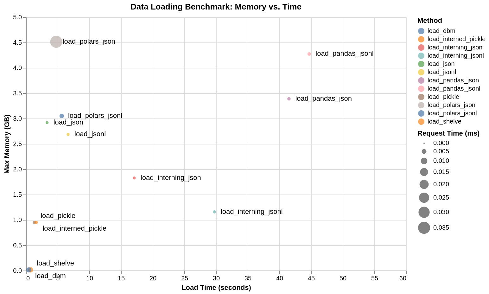

# static-lookup-api-options-python

Investigating memory utilisation, load time and lookup latency across different implementations in Python. 

Loading static datasets (examples: reference data, configuration, recommendations, cleaned up or pre-analysed data) to be looked up by key and used by another service is a common need. These are not typically "big data" scale, comprising up to millions of records and low-GB scale on disk when uncompressed.

A preferable solution:

- requires minimal resources, especially memory
- has simple, predictable scaling characteristics
- loads new data quickly
- looks up records quickly
- has a simple implementation
- avoids third-party dependencies

Using Python to load these datasets into memory often needs more memory than expected, with Out-Of-Memory (OOM) crashes and excessive infrastructure costs. The default choice for many data practitioners is Pandas, a tool taught in every data science bootcamp, designed for numerical analysis. This repo explores different options using GitHub actions, and [raw data artefacts are avaiable in the Actions tab](https://github.com/brabster/static-lookup-api-options-python/actions/runs/20674448396).

## Conclusion up front

Pandas and Polars are the wrong tool for this job, in particular consuming far more memory than is necessary.

Using Python's built-in `dbm` module allows records to be looked up directly from disk instead of loading into memory, meeting all the needs listed above. Serving requests from a web API using dbm.ndbm performs similarly to serving the requests from memory.

Other options provide different trade-offs of memory utilisation and loading time.

## Experimental setup

[A dataset is generated](./generate_dataset.py) representing a common lookup scenario: looking up a list of product recommendations for a customer, using UUID strings for both customer and product IDs to avoid any assumptions about IDs. There are 1m customers with 10 product recommendations each. Products are picked from a pool of 10k product IDs. The dataset is saved in a variety of formats to support different consuming implementations, along with a sample of 100 randomly-selected customer IDs. The raw JSON dataset is around 450MB uncompressed.

[A test harness](./test_harness.py) loads the appropriate dataset format ten times, simulating the common reload-in-memory approach that usually requires enough memory to hold two copies of the data in memory to enable the swap. (I avoid mutating in-place as that avoids significant classes of errors and uncertainties). The harness then times a look up of the 100 customer ID samples to measure the lookup latency.

The test suite runs on GitHub Actions `ubuntu-slim` runners that have around 5GB of memory available.

[A simple performance test](./load_dbm_serve_test.py) over the most operable options, using the [Locust load testing framework](https://docs.locust.io/en/stable/index.html) tests a simple Flask/gunicorn webapp that wraps the implementation.

## Results (1m customers with 10 recs from 10k products)

### [Pandas](https://pandas.pydata.org/)

A data analysis library, the default choice for many data practitioners. 

[load_pandas_json.py](./load_pandas_json.py) and [load_pandas_jsonl.py](./load_pandas_jsonl.py) are the worst-performing cluster.

**Conclusion: memory-hungry and slow, requires third-party packages.**

### [Polars](https://pola.rs/)

A newer data analysis library and alternative to Pandas written in Rust.

[load_polars_json.py](./load_polars_json.py) and [load_polars_jsonl.py](./load_polars_jsonl.py) consume a similar amound of memory to Pandas, but are much faster to reload at around 5 seconds. Relatively high lookup latency.

**Conclusion: even more memory-hungry, quicker to load, slower to lookup, requires third-party packages**

### [Python-native JSON](https://docs.python.org/3/library/json.html)

Using Python's built-in JSON parsing.

[load_json.py](./load_json.py) and [load_jsonl.py](./load_jsonl.py) consume less memory than Pandas and Polars, and have a similar load latency to Polars, but faster lookup.

**Conclusion: a little less memory-hungry, faster lookups.**

### Python-native JSON with [string interning](https://docs.python.org/3/library/sys.html#sys.intern)

Using Python's built-in JSON parsing, but explicitly interning the product ID strings that we know are duplicated many times.

[load_interned_json.py](./load_interned_json.py) and [load_interned_jsonl.py](./load_interned_jsonl.py) use a lot less memory but the interning means it takes longer to load.

**Conclusion: much less memory-hungry, higher load latency.**

### [Python-native pickle](https://docs.python.org/3/library/pickle.html)

Using pickle to store the dictionary structure to disk. Explicit string interning makes little difference, the internals of pickle may cause interning automatically.

[load_pickle.py](./load_pickle.py) and [load_interned_pickle.py](./load_interned_pickle.py) shift work to the write operation, making the load operation much more memory and time-efficient.

Pickle files can contain executable code and can represent a security risk if the pickle file isn't coming from a trustworthy source.

**Conclusion: much less memory-hungry, much faster to load.**

### Key-value lookup from disk with [dbm](https://docs.python.org/3/library/dbm.html) and [shelve](https://docs.python.org/3/library/shelve.html)

Python ships with persistent key-value storage implementing the dictionary API. Instead of loading the dataset into memory, we look up from database file on-demand. As we are atomically swapping the database, we operate in read-only mode and have no read/write-related concurrency issues.

[load_dbm.py](./load_dbm.py) opens a dbm.ndbm database stored by the data generator. The values are stored as JSON strings, and parsed on lookup. [load_shelve.py](load_shelve.py) does the same, but it uses pickle for values, so comes with the same security considerations. Both "reload" instantly and use negligble additional memory to do so.

**Conclusion: instant atomic reloads in constant time and memory with fast lookup performance.**

## Load testing

The load test runs 100 concurrent users over 4 threads, looking up recommendations for the random sample of customer iDs. This was done in the local dev envronment for the pickle-based solution and for the dbm-based solution. The results are similar for the two implementations, with the dbm-based implementation counterintuitively coming out a little faster over each of three runs, perhaps because there was more memory available for the dbm implementation.

Here are example run stats over 60s. The behaviour was similar over several runs for each implementation.

### dbm.ndbm

Response time percentiles (ms, approximated)
|Type    |Name             |     50%|   95%|  100%|# reqs|
|--------|-----------------|--------|------|------|------|
|GET     |/recommendations |      14|    41|   440| 60570|

###  pickle

Response time percentiles  (ms, approximated)
Type    |Name              |     50%|   95%|  100%|# reqs|
--------|------------------|--------|------|------|------|
GET     |/recommendations  |      16|    40|  5000| 55533|

